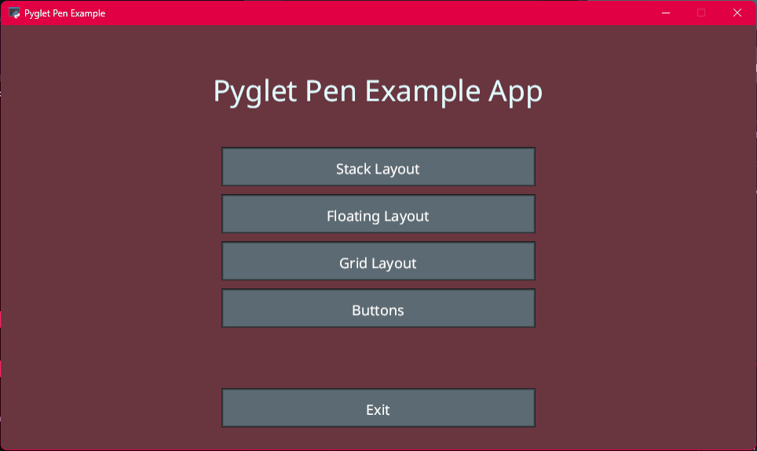
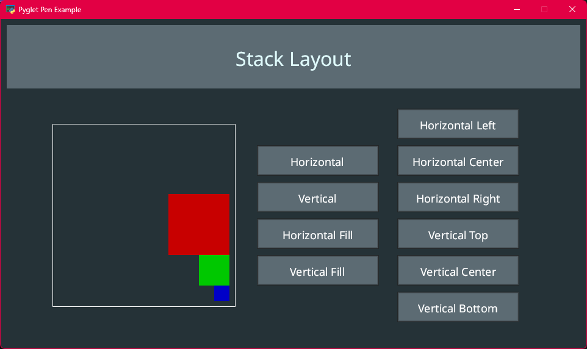
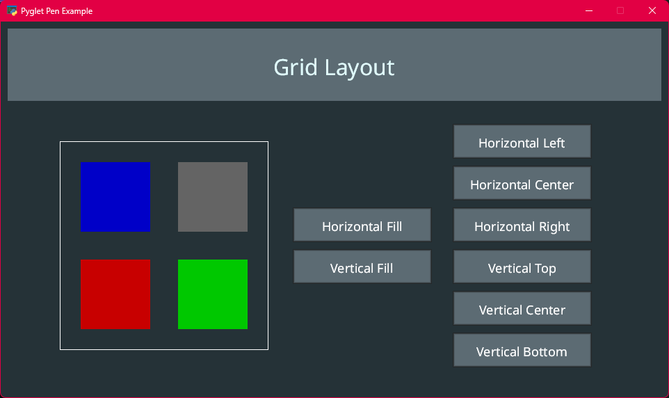
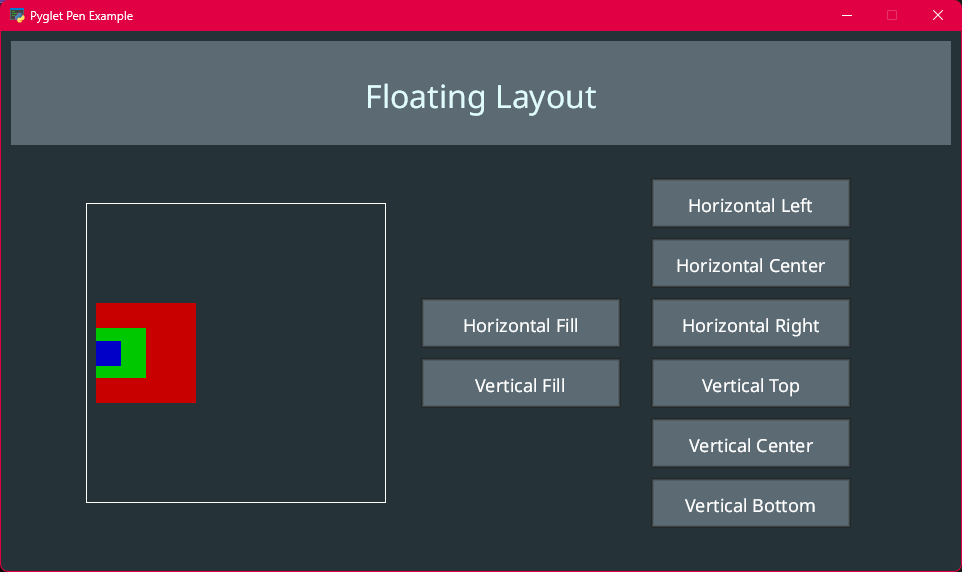
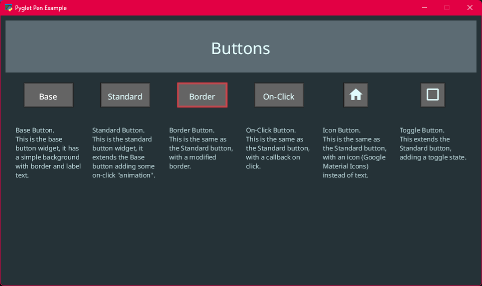

# pyglet_pen

__NOTE: This project is still a work in progress, please expect bugs and missing features.__

Pyglet Pen is an extension of the [Pyglet](https://github.com/pyglet/pyglet) library, providing tooling to help manage the creation of GUIs.  
This currently includes:
 - Views  
   A `View` is a container for everything that should be currently drawn on the screen.
 - Layouts  
   A `Layout` manages the positioning of `Widgets` and `Elements`.
 - Widgets  
   Widgets are interactable collections of `Elements`.
 - Elements  
   An `Element` is a single interactable, drawable element.

## About
Pyglet Pen is designed to provide a simple way to build complex GUIs in Pyglet. It provides a set of commonly used GUI widgets, such as buttons, text boxes, and ..., as well as providing mechanisms to arrange them on screen. Pyglet Pen also implements Views in order to allow switching between different screens, such as a main menu and a game screen.

## Background
I have a love for the Pyglet library and the simplistic nature of just rendering basic shapes; however, I found that I was spending a lot of time writing the same framework-like code for each project. So, I decided to create Pyglet Pen to help reduce the amount of boilerplate code I had to write for each project to help me focus on the actual logic.

## Examples
There is an example application in `src/pyglet_pen/example/` which provides an interactive example of the features of Pyglet Pen.

### Screenshots

